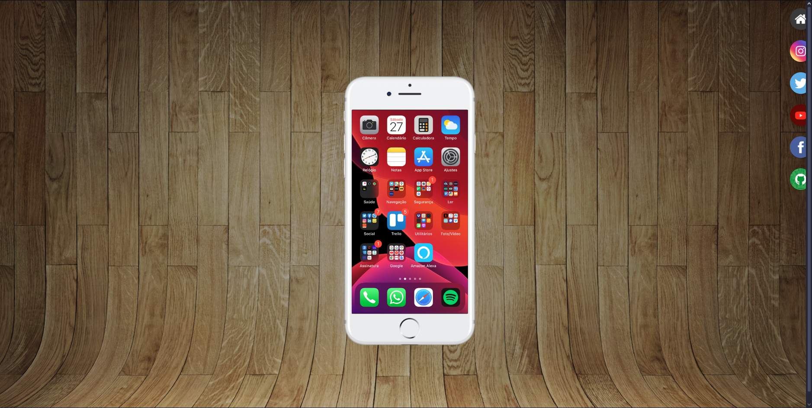

# CSS Layout with Icons

This project was created to practice HTML and CSS fundamentals, focusing on layout composition, background images, and element positioning.

The layout features a static mobile UI mockup with social media icons, developed as part of the HTML5 and CSS3 learning process.

## 📸 Screenshot

## 🛠️ Built with
- HTML5
- CSS3

## 🎯 Purpose
- Practice CSS layout and positioning
- Work with background images
- Improve visual composition using icons

## 🌐 Deployment
This project was deployed using *GitHub Pages* to practice publishing and maintaining a live static website.
[https://gabriellecalabria.github.io/css-layout-practice/]
